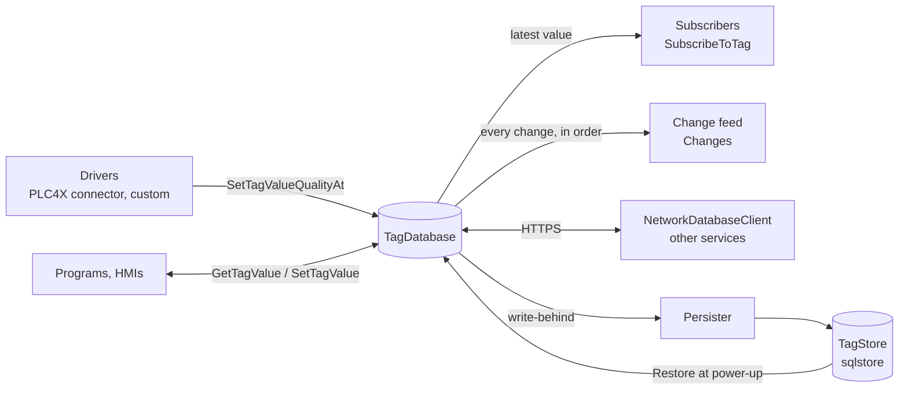

# Architecture

## Packages

| Package | Files | Role |
|---|---|---|
| `honeycomb` | `TagDatabase.go` | The `TagDatabase`, `Tag`, `TypeInfo`, type registry, value access, forcing, aliases, tag files, process images |
| | `quality.go` | `Quality` and its conversions to OPC DA, OPC UA and PLC4X codes |
| | `changefeed.go`, `changefeed_network.go` | The ordered change feed, in process and over HTTP |
| | `batchread.go` | `ReadTags` and the batch-read endpoints |
| | `persistence.go` | `TagStore`, `Persister`: retained values in a durable store |
| | `network_server.go`, `network_client.go` | The HTTPS API and `NetworkDatabaseClient` |
| `store/sqlstore` | | A `TagStore` on `database/sql`, with dialects and migrations for SQLite, PostgreSQL, CockroachDB, MySQL/MariaDB and SQL Server |
| `shared` | | Sample types and tags used by the examples |
| `connectors/plc4x` (own module) | | Exchanges tags with field devices through Apache PLC4X |
| `examples/` | | `simple`, `subscription`, `network_server`, `network_client`, `sqlite_persistence` |

## Data model

A `TagDatabase` holds **tags** by unique name. A tag has:

- a **value** of a Go type that maps to an IEC 61131-3 data type
  (royaljelly's `iec.DINT`, `iec.REAL`, ..., a slice for an array, a pointer
  to a struct for a UDT, a string for an enumeration);
- a **`TypeInfo`**, shared between tags of the same type, that the value is
  checked against on every write (data type, element type, enumeration
  values, subrange, string length, array dimensions);
- a **quality** (Unknown, Good, Uncertain, Bad) and a **timestamp** (when
  the value or quality last changed, the device's time when a driver gives
  it);
- **qualifiers**: `Constant` (never written after creation), `Retain`
  (persisted across restarts);
- optional **force** (`Force *ForceInfo`): reads return the force value
  instead of the value. Setting, changing or releasing a force
  (`SetTagForced`, `SetTagForceValue`) is a change like a write: subscribers
  and the change feed see the value a reader now gets;
- optional **alias** (another name), **direct address** (`%MW10`), and
  **remote alias** (the tag lives in another database).

See [Tags and types](tags.md).

## How values flow

Every successful write:

1. checks the value against the tag's `TypeInfo` and stores it, with its
   quality and timestamp, under the tag's lock;
2. records a change in the change feed, if the value or quality changed;
3. replaces the pending update of each subscriber with the new state;
4. marks the tag dirty for the `Persister`, if one is attached.

Writes never wait for subscribers, feed readers or the store. A force set,
changed or released goes through steps 2 and 3 too, so a mirror of the
database (beehive's tags service, an HMI) shows forced values as they are
read.

## Concurrency model

- **Tags** are kept in a `sync.Map` keyed by name; adding, removing and
  looking up a tag need no global lock.
- **Each tag has its own read-write lock** (`valMu`). A write takes the
  write lock for the check and the store; a read takes the read lock.
  Structured values are changed in place: writing `Motor.Speed` or
  `Arr[1].Speed` changes the field under the owning tag's write lock, and
  reading a field takes the owning tag's read lock while it reads it (see
  [Development: known issues](development.md#known-issues)).
- **Notifications are serialized per tag** (`notifyMu`), so subscribers see
  a tag's updates in order even with concurrent writers.
- **The type registry, enumeration registry and UDT registry** are global
  and safe for concurrent use; register types at start-up.
- A `Tag` returned by `GetTag`, `GetAllTags` or a subscription is a **copy
  without locks**. Its `Value` may still be a pointer or slice shared with
  the database: treat it as read-only.

## Remote databases

A database can register other databases (`RegisterDatabase(id, accessor)`)
and hold **remote aliases**: tags whose reads and writes go to a tag of the
registered database. The accessor is another `TagDatabase` in the same
process or a `NetworkDatabaseClient` for a server reached over HTTPS. See
[Network API](network.md#remote-aliases).

## Design choices

- **The value's Go type is the type check.** royaljelly's IEC types are
  distinct Go types (`iec.INT` is not `iec.DINT`), so a write of the wrong
  type fails without any parsing.
- **Quality and timestamp travel with the value.** A driver writes all
  three in one call, so a reader never sees a new value with an old
  quality.
- **Subscriptions keep the newest state; the change feed keeps every
  change.** HMIs want the first, sequence-of-events recorders and alarm
  engines want the second. See [Subscriptions and the change feed](events.md).
- **Memory is the system of record while running.** A store is written
  behind the writes and read at power-up, like a PLC's retain memory. See
  [Persistence](persistence.md).
- **Minimal dependencies.** The core depends on royaljelly and the standard
  library; SQL drivers and PLC4X are chosen by the application.
